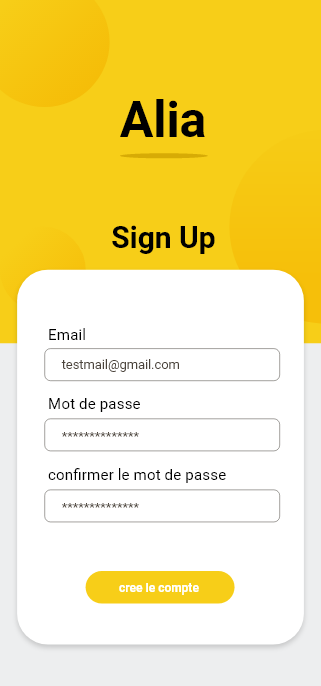
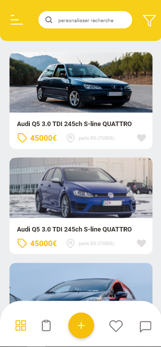
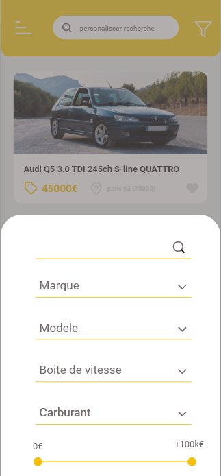
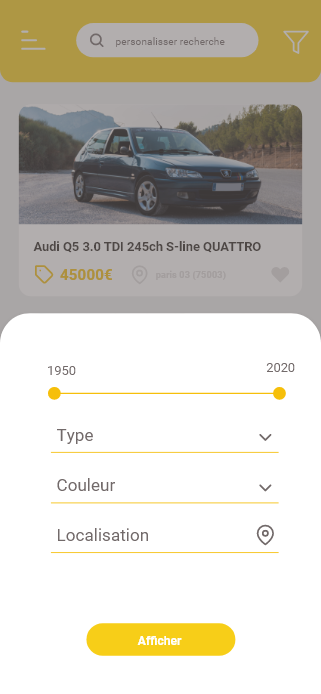
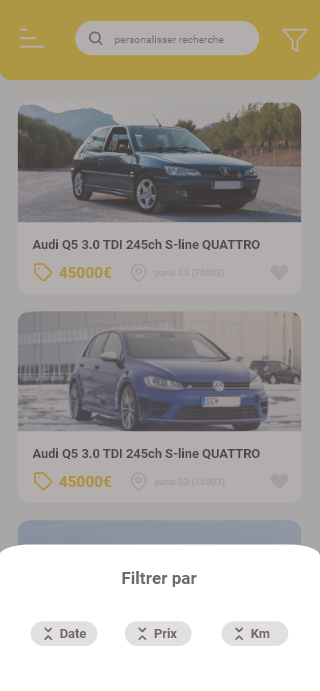
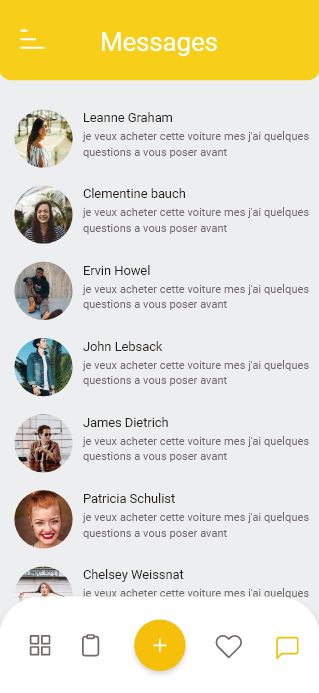
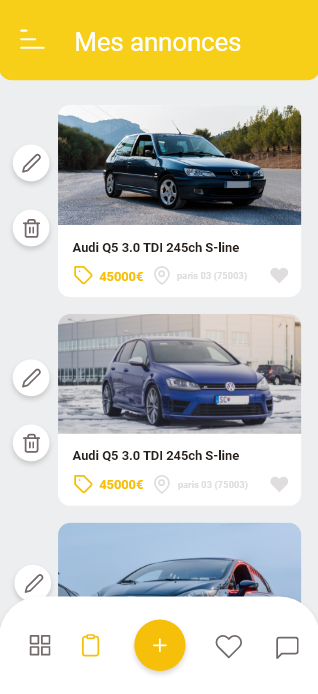

# Cars Retail App - Alia Auto -

this repo represent my simple implementation with React native of a car retail app for a freelance job (that was canceled for lack of resources), this project can run on Android only (i didn't use expo because my analyse at the time showed that i need some custom functionality not implemented with expo).

The architecture proposed in this implementation can help new react native developers in understanding how the flow of screens and api events work, its not a perfect architecture, but a good and maintainable one.

## Folders structure

this project is devised into multiple folders to allow code decomposition and architecture maintainability in the future. Globally, we can find two main folders:

- **Assets**
- **src**

In the Assets Folder we put our images and custom styles while in the src folder, our application code.

this source folder is composed of 6 sub-folders each containing a specific code, there are represented like so :

- **API folder :** containing api requests for multiple tasks (each task in its file like event requests in the EventApi file) ==> we can say that this folder is similar to the repository folder in an MVC architecture.
- **Components folder :** containing our react native components (that keeps repeating or that are not entire screens) .
- **Constants :** we put in this folder our app constants used in the project, like the axios Instance for exemple (its like the singleton pattern).
- **Routes :** in any app, especially a react native app we need to handle Routes and navigations, this folder structure them and try to provide a simple interface to access some handlers of the root navigator.
- **screens :** this folder is self explanatory, each file represent a screen in the app that is routed with the configuration in the navigation folder above.
- **Store :** redux store index and actions, reducers folders and file, i prefer separating redux code parts to have all the access to the global store in a readable and maintainable format.
- **Config :** contains the configuration of the app, like api global url, name, url ... 

## How does the app look like ?

- **Auth :**

|             Sign in             |             Sign up             |
| :-----------------------------: | :-----------------------------: |
|  |  |

- **Home :**

- **Search :** 

|              search 1              |              search 2              | search 3                           |
| :--------------------------------: | :--------------------------------: | ---------------------------------- |
|  |  |  |

- **Filters :** 

- **Chat :**

- **My Annonces :** 

## How to run 

1. Prepare your environment by following the getting started [tutorial](https://reactnative.dev/docs/getting-started).
2. clone this repo, and go to the project root directory.
3. run yarn install.
4. run yarn start to run it on android (check package.json file).

## Design template

the design for this app is self made with adobe xd, you can find the UI in this [link](https://xd.adobe.com/view/c37d4ede-df38-46c0-6bac-02fbebfeae1e-b54c/) 

the password to access the design is: Abidou14dj

------

For anyone interested with the project, feel free to contact me anytime in my email:

[fa_djellal@esi.dz]()